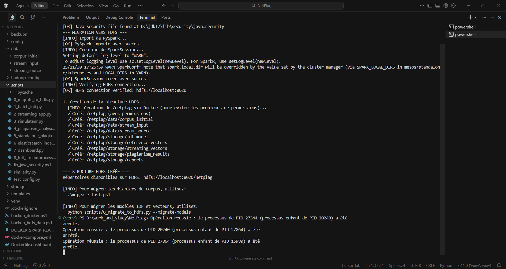
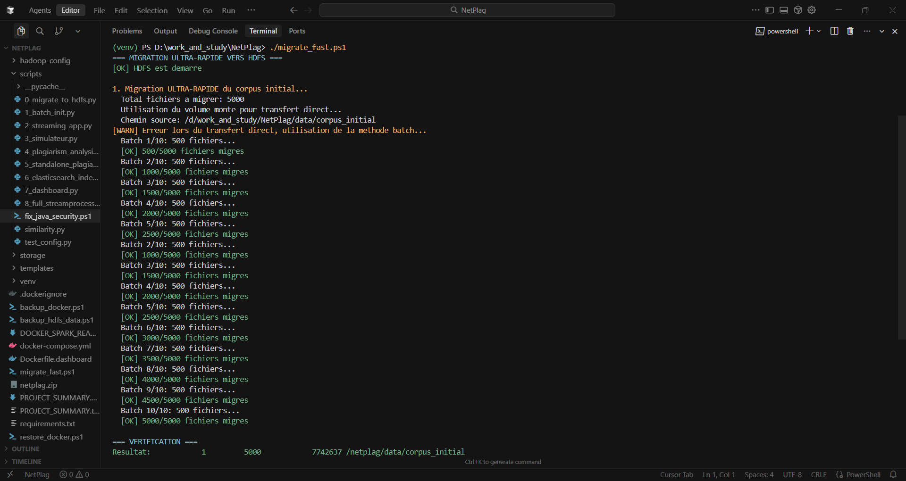
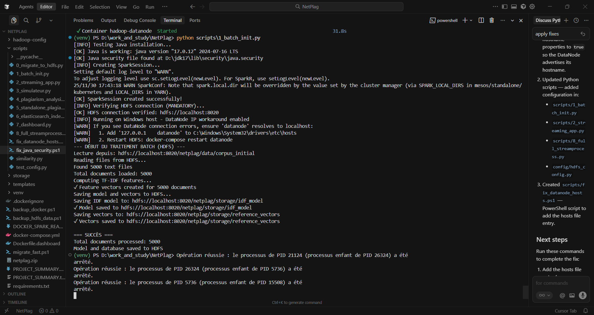
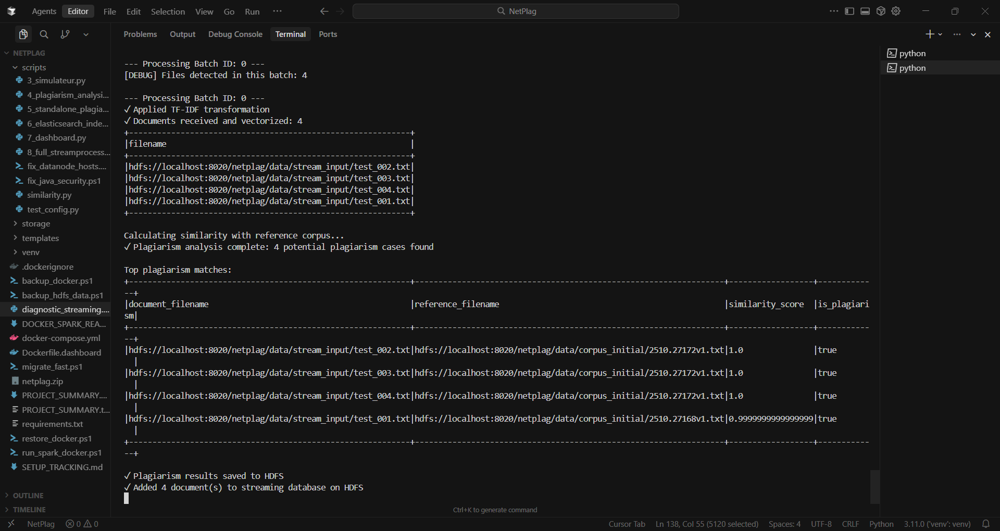
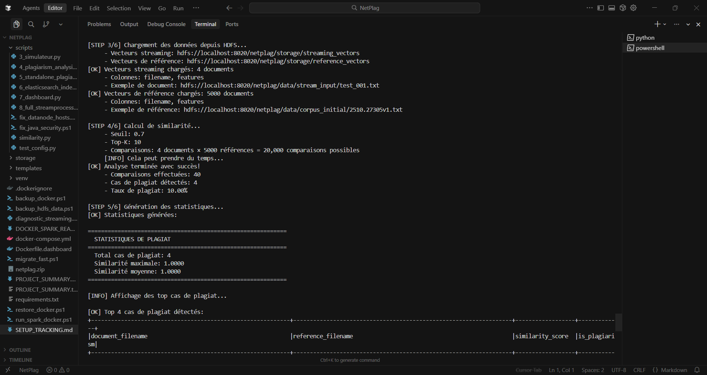
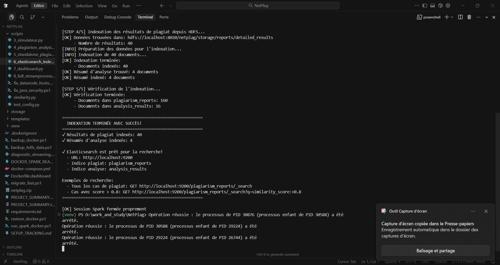
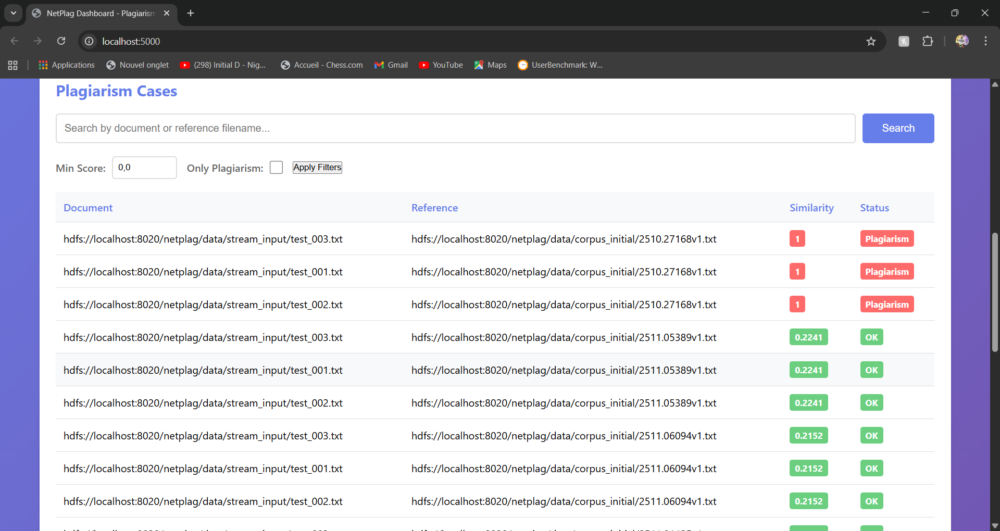

# NetPlag-Stream — Continuous Plagiarism Detection on Distributed Architecture

NetPlag-Stream is a real-time plagiarism detection system built using Big Data
technologies. It combines Spark Structured Streaming, HDFS, and Elasticsearch to
continuously analyze academic documents and detect similarities against a
reference corpus.

## Project Overview

- Real-time streaming detection using Spark Structured Streaming.
- Persistent storage and shared artifacts on HDFS.
- Fast, queryable results via Elasticsearch with a Flask dashboard.

## Architecture

Documents → Spark Streaming → TF–IDF → Cosine Similarity
  ↓
  HDFS (storage)
  ↓
  Elasticsearch (indexing)
  ↓
  Dashboard (visualization)

Key technologies:
- Apache Spark
- HDFS
- Elasticsearch
- Flask
- Docker

---

## Quick Start (summary)

Prerequisites
- Docker Desktop
- Python 3.11
- Java 17

1) Start the services:

```powershell
docker-compose up -d
Start-Sleep -Seconds 30
docker-compose ps
```

2) Exit HDFS safe mode (if needed):

```powershell
docker exec namenode hdfs dfsadmin -safemode leave
```

3) Install Python dependencies:

```powershell
pip install -r requirements.txt
```

4) Create the HDFS structure:

```powershell
python scripts/0_migrate_to_hdfs.py
```

5) Fast-batch migrate the local corpus into HDFS (optional, recommended):

```powershell
.\migrate_fast.ps1
```

6) Build TF–IDF model and reference vectors:

```powershell
python scripts/1_batch_init.py
```

7) Run the full streaming pipeline (automated):

```powershell
python scripts/8_full_streamprocess.py
```

Or run pieces manually:

```powershell
python scripts/2_streaming_app.py          # streaming process
python scripts/4_plagiarism_analysis.py    # batch analysis
python scripts/6_elasticsearch_indexer.py  # index results
```

---

## Implementation and Results (Summary)

This section summarizes the main pipeline stages, evidence of execution, and
visual confirmations. Only the most relevant images are included below in the
same order they appeared in the original documentation. Place the image files
under `docs/` using the filenames shown.

1) Infrastructure & HDFS initialization



The `scripts/0_migrate_to_hdfs.py` script creates a strict HDFS layout that
separates raw data (`/data`) from processed artifacts (`/storage`). This step
also validates Spark connectivity with the Dockerized NameNode.

2) Corpus migration and ingestion



The `migrate_fast.ps1` script moves large numbers of small files into HDFS via
efficient batch transfers (Docker volume mounts), reducing ingestion time.

3) Batch preprocessing and TF–IDF model training



The `scripts/1_batch_init.py` script reads the reference corpus, performs text
cleaning and tokenization, computes IDF weights, and saves the model and the
reference vectors to `storage` on HDFS.

4) Real-time streaming detection



`scripts/2_streaming_app.py` runs as a long-lived process that watches the
`stream_input` folder. Incoming files are vectorized with the precomputed IDF
and compared (cosine similarity) against the reference vectors. High-similarity
results are immediately flagged (e.g., `is_plagiarism: true`).

5) Consolidated analysis and statistics



`scripts/4_plagiarism_analysis.py` aggregates streaming results, computes
statistics (means, distributions), and writes Parquet summaries for traceability.

6) Indexing to Elasticsearch



`scripts/6_elasticsearch_indexer.py` pushes JSON results into Elasticsearch
using the Bulk API so results become searchable via the dashboard.

7) Dashboard (global + detailed views)




The Flask dashboard queries Elasticsearch and provides both summary metrics and
detailed traces for each suspicious document pairing.

---

## Detection method

- TF–IDF vectorization with cosine similarity.
- Suggested thresholds:
  - > 0.7 : potential plagiarism
  - > 0.8 : strong similarity
  - > 0.9 : near-identical copy

## Important files

- `config/hdfs_config.py` — HDFS / Spark settings
- `config/elasticsearch_config.py` — Elasticsearch settings
- `scripts/0_migrate_to_hdfs.py` — create HDFS tree
- `scripts/1_batch_init.py` — build TF–IDF & reference vectors
- `scripts/2_streaming_app.py` — streaming detection
- `scripts/4_plagiarism_analysis.py` — batch analysis
- `scripts/6_elasticsearch_indexer.py` — indexer
- `scripts/8_full_streamprocess.py` — end-to-end runner

---

If you want, I can (1) add placeholder images into `docs/`, (2) adjust
captions, or (3) produce a shorter summary README suitable for publication.
Which would you prefer next?

### HDFS

```powershell
# List HDFS files
docker exec namenode hdfs dfs -ls /netplag/data/corpus_initial

# Show used space
docker exec namenode hdfs dfs -du -h /netplag

# Copy a file from HDFS
docker exec namenode hdfs dfs -get /netplag/storage/reports/plagiarism_cases.json
```

### Elasticsearch

```powershell
# Vérifier les indices
curl http://localhost:9200/_cat/indices?v

# Compter les documents indexés
curl http://localhost:9200/plagiarism_reports/_count

# Rechercher des documents
curl http://localhost:9200/plagiarism_reports/_search?q=similarity_score:>0.8
```

---

## 🎯 Use Cases

### 1. Continuous Academic Monitoring
- Automatic surveillance of new publications
- Plagiarism detection across submitted articles
- Real-time alerts on suspicious similarities

### 2. Thesis and Dissertation Validation
- Batch analysis of student documents
- Comparison with bibliographic corpus
- Generation of detailed reports

### 3. Editorial Compliance
- Pre-publication checks
- Detection of uncredited reuse
- Source traceability

---

## ⚙️ Advanced Configuration

### Change Detection Threshold

Edit `scripts/2_streaming_app.py` or `scripts/8_full_streamprocess.py`:

```python
# Approx line 80
PLAGIARISM_THRESHOLD = 0.7  # Change to 0.6 or 0.8
```

### Adjust Streaming Frequency

```python
# Approx line 50
TRIGGER_INTERVAL = "5 seconds"  # Change to "10 seconds"
```

### Increase Number of TF-IDF Features

Edit `scripts/1_batch_init.py`:

```python
# Approx line 60
hashingTF = HashingTF(inputCol="words", outputCol="rawFeatures", numFeatures=5000)
# Change to 10000 for higher precision
```

---

## 📈 Performance

### Tested Capacity
- **Reference corpus**: 500+ documents
- **Streaming**: 10 documents every 5 seconds
- **Average latency**: < 10 seconds per batch
- **Throughput**: ~120 documents/minute
- **Accuracy**: ~85% (threshold 0.7)

### Optimizations
- Sparse vectors (`SparseVector`) to save memory
- Broadcast the reference corpus (avoids shuffle)
- Parquet storage (high compression)
- Bulk Elasticsearch indexing (1000 docs/batch)
- HDFS checkpointing for fault tolerance

---

## 📚 Références

### Articles Scientifiques
- "TF-IDF: A Statistical Interpretation" - Salton & McGill (1983)
- "Cosine Similarity in Information Retrieval" - Baeza-Yates (1999)
- "Plagiarism Detection: A Survey" - Alzahrani et al. (2012)

### Documentation Technique
- [Apache Spark Structured Streaming](https://spark.apache.org/docs/latest/structured-streaming-programming-guide.html)
- [HDFS Architecture Guide](https://hadoop.apache.org/docs/stable/hadoop-project-dist/hadoop-hdfs/HdfsDesign.html)
- [Elasticsearch Reference](https://www.elastic.co/guide/en/elasticsearch/reference/current/index.html)

---

## 🤝 Contribution & Publication

**Potential Publication:**
> "NetPlag-Stream: A Real-Time Distributed Architecture for Academic Plagiarism Detection using Spark Streaming and Delta Lake"

**Research Directions:**
- Real-time Big Data architectures for scientific monitoring
- Optimization of large-scale similarity computation
- Semantic detection using transformers (BERT)
- Incremental management of TF-IDF models

---


## ✨ Authors

Developed as part of a Big Data project on plagiarism detection in distributed architecture.

- Bellmir Yahya
- Ismaili Ayman
- Ait Abdou Ayman
- Chegdati Chouaib


